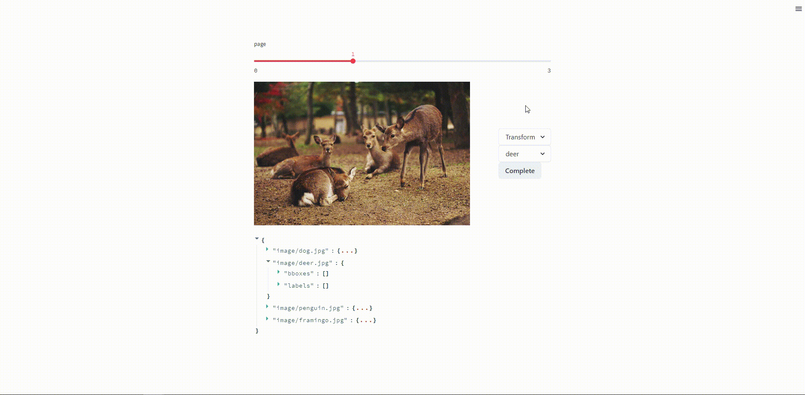

# Streamlit Image Annotation

Streamlit component for image annotation.

[](https://st-image-annotation.streamlit.app/)
[](https://pypi.org/project/streamlit-image-annotation/)

# Features
* You can easily launch an image annotation tool using streamlit.
* By customizing the pre- and post-processing, you can achieve your preferred annotation workflow.
* Currently supports classification and detection tasks.
* Simple UI that is easy to navigate.

# Install
```sh
pip install streamlit-image-annotation
```
# Example Usage
If you want to see other use cases, please check inside the examples folder.
```python
from glob import glob
import pandas as pd
import streamlit as st
from streamlit_image_annotation import classification

label_list = ['deer', 'human', 'dog', 'penguin', 'framingo', 'teddy bear']
image_path_list = glob('image/*.jpg')
if 'result_df' not in st.session_state:
    st.session_state['result_df'] = pd.DataFrame.from_dict({'image': image_path_list, 'label': [0]*len(image_path_list)}).copy()

num_page = st.slider('page', 0, len(image_path_list)-1, 0)
label = classification(image_path_list[num_page], 
                        label_list=label_list, 
                        default_label_index=int(st.session_state['result_df'].loc[num_page, 'label']))

if label is not None and label['label'] != st.session_state['result_df'].loc[num_page, 'label']:
    st.session_state['result_df'].loc[num_page, 'label'] = label_list.index(label['label'])
st.table(st.session_state['result_df'])
```
# Future Work
* Refactoring of the source code.
* Addition of docs about API.
* Addition of example code.
* Addition of segmentation and point tasks.

